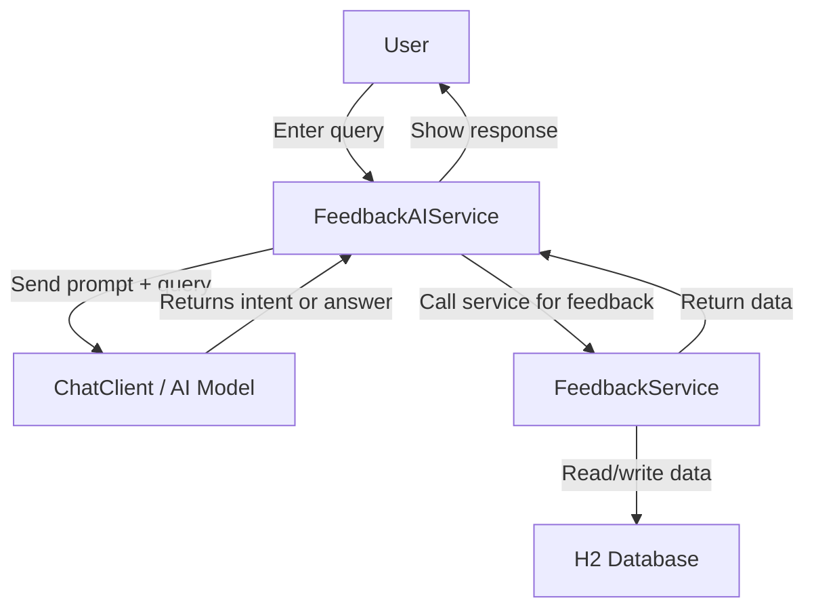

# food-feedback-system-ai

A Spring Boot application that uses AI-driven chat prompts to interact with a food feedback system backed by H2.

## Overview

This project captures customer feedback for food items and uses an AI chat client to interpret user queries and route them to the feedback service.

## Components

- `LearningApplication` - Spring Boot main application.
- `FeedbackAIService` - sends user queries to the AI chat client and returns the model response.
- `FeedbackService` - saves and retrieves feedback from the database.
- `FeedbackRepository` - JPA repository for the `Feedback` entity.
- `Feedback` entity - stores feedback details such as name, mobile, food, rating, and description.
- H2 database - in-memory datastore for feedback data.

## Flow Diagram



## How it works

1. The user enters a feedback-related query.
2. The `FeedbackAIService` sends the query and a system prompt to the AI chat client.
3. The AI response is used to determine whether to save feedback or retrieve existing feedback.
4. `FeedbackService` persists/retrieves data through JPA.
5. The app stores data in the embedded H2 database.

## Run locally

```bash
./mvnw spring-boot:run
```

If you use the H2 profile, access the console at `http://localhost:8080/h2-console`.

## Notes

- The project uses an in-memory H2 database, so data is cleared on shutdown unless a file-based URL is configured.
- Ensure the correct Spring profile and H2 console settings are enabled in `application.yaml` / `application-h2.yaml`.


